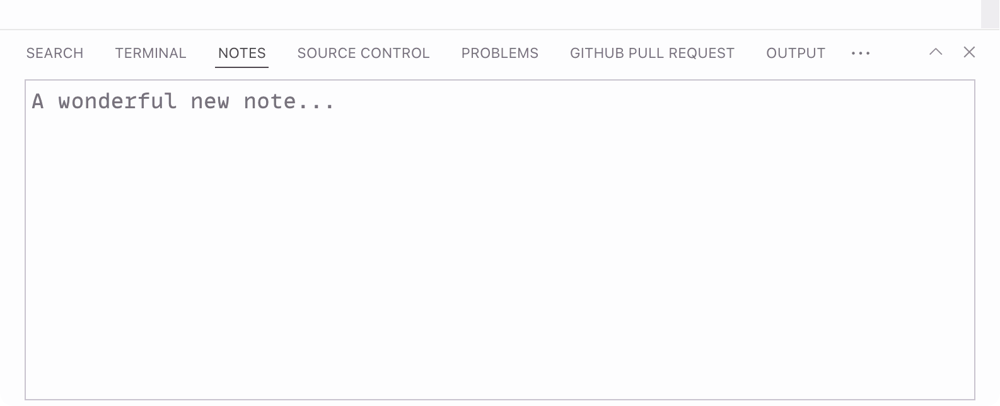

# Notebox 📝

Take quick notes in the VS Code’s bottom panel.

**[Install from Visual Studio Marketplace](https://marketplace.visualstudio.com/items?itemName=sapegin.notebox)**

## How it works?

Open the bottom panel, and select **Notes**:

_The notes are persisted even if you close VS Code or switch to another workspace._

## Changelog

The changelog can be found on the [Changelog.md](./Changelog.md) file.

## Motivation

There are several extensions for writing notes inside VS Code, but all are either too complex, or not working at all. I wanted something simple, a place to write a short reminder for myself, or store a piece of text or code that will be useful later.

## You may also like

Check out my other Visual Studio Code extensions:

- [Just Blame](https://marketplace.visualstudio.com/items?itemName=sapegin.just-blame): Git Blame annotations, inspired by JetBrains editors
- [Emoji Console Log](https://marketplace.visualstudio.com/items?itemName=sapegin.emoji-console-log): insert `console.log()` statements with a random emoji
- [Mini Markdown](https://marketplace.visualstudio.com/items?itemName=sapegin.mini-markdown): minimalist kit for comfortable Markdown writing
- [New File Now](https://marketplace.visualstudio.com/items?itemName=sapegin.new-file-now): create new files from the command palette
- [Todo Tomorrow](https://marketplace.visualstudio.com/items?itemName=sapegin.todo-tomorrow): highlight `TODO`, `HACK`, `FIXME`, etc. comments
- [Squirrelsong Light Theme](https://marketplace.visualstudio.com/items?itemName=sapegin.Theme-SquirrelsongLight): low contrast non-distracting light theme for web developers
- [Squirrelsong Dark Theme](https://marketplace.visualstudio.com/items?itemName=sapegin.Theme-SquirrelsongDark): low contrast non-distracting dark theme for web developers

## Sponsoring

This software has been developed with lots of coffee, buy me one more cup to keep it going.

## Contributing

Bug fixes are welcome, but not new features. Please take a moment to review the [contributing guidelines](Contributing.md).

## Authors and license

[Artem Sapegin](https://sapegin.me), and [contributors](https://github.com/sapegin/vscode-notebox/graphs/contributors).

MIT License, see the included [License.md](License.md) file.
